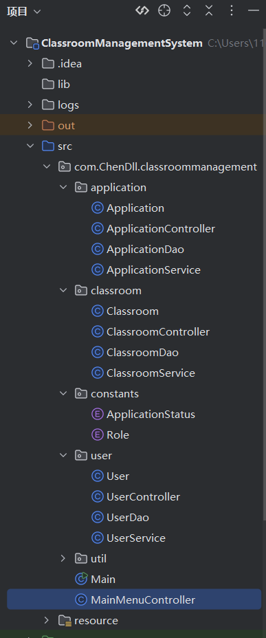

## 调完一堆bug之后の回顾

-   一开始按照MVC框架 分模块列了十几个文件

-   最终结构 （resource文件夹里面还有logback.xml）

-   先分析要什么功能 需要什么变量（后面发现变量巨多
    想写一个功能都要加一堆变量） 写实体类 在按照MVC的思路
    分别往里面塞函数 三个模块大同小异 没有复杂的逻辑
    就是代码解耦（反复套娃  然后把一些常量写到常量类里面（枚举比较方便
    从stm32那学的

-   最先用数组存数据 写了个基本逻辑框架 （Old版本

-   后面开始链接数据库MySQL(不得不说SQLyog确实好用 虽然只有十五天能用

-   先设计数据库表格 还有调试链接数据库 把数据从数据库拿出来 写进去 查找
    修改（增删查改）花了很久 主要是语法不太熟 还有变量名没对上

-   编译没问题 一调试空指针异常 各种名称不匹配 后面调整了很久表格列
    加了些格式化 还有异常处理

-   最后还加了个定时事件定时更新申请状态
    这里还要在提交申请的时候计算过期时间 然后存进数据库定时判断过期

-   小插曲 想用HikariCP 结果这东西的日志全往控制台输
    网上说在resource文件夹写 logback.xml
    我用的是intellj创建的项目啥也没有
    最后自己创建一个resource文件夹标记为资源文件夹再写logback.xml输出就重定向到日志文件（就成了

-   然后是各种暴力检测 不断调整控制台交互界面（模拟各种奇怪输入
    各种操作组合

-   登录密码输错三次暂停5秒钟（防止暴力破解

-   写各种欢迎信息 特别地加了当前时间（提醒我写多久代码了

-   查看所有课室和申请 格式化了输出 （更好看

-   然后在方法类写了输入方法 以防用户乱输东西（鲁棒性 Strong💪

-   输入时间格式 还有结束时间不能早于开始时间 （顺手加的

-   一开始没有分角色 太多功能一大堆不好看 所以分了角色
    也是封装了几个函数（一堆bug

-   在表里面加了很多数据用来调试（各种奇怪的数据全加进去暴力测试

-   用户密码不能直接加 我在程序里面加了密
    要在程序里注册然后把加了密存在数据库的值复制过去（自讨苦吃

-   后面发现在密码输入三次后的处理有逻辑问题 登录了账户后退出
    然后输错三次密码后选择退出 结果直接登录到上个用户界面
    然后不好直接创建main实例 又把main方法封装成一个类
    然后调用方法（也是调试了一会 输入3直接System.exit(0);

-   此处省略一堆逻辑的加入过程（比如已经标志过期的申请就不显示在申请列表里面
    一个学生最多三个申请 教室用不了申请自动标记拒绝 管理员就不用审批了
    还有时间冲突检测 注册时判断是不是已经注册的用户名

-   最后加了一个课室统计功能 计算百分率

-   还想写一个测试类 用Junit 感觉不如手动暴力测试

-   还有很多遇到的bug 一时想不起来（2025/2/6 1:25

-   最后面跟着编译器的警告 封装了重复的代码段 改了些语法

-   并排查看很清晰

-   导了一些库配置数据库

-   最后写了自述文档，完结（把项目公开

-   后续想把项目导个jar包，数据库也导出来好移植

