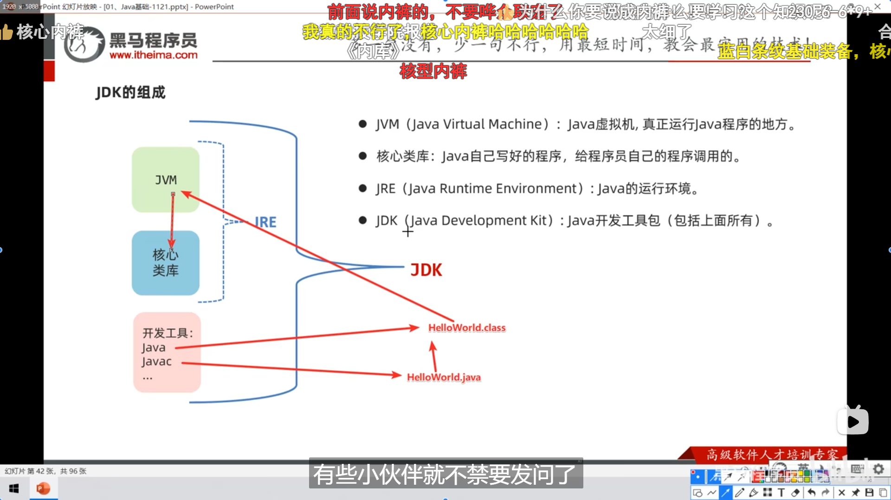

配置了 IntelliJ IDEA 和 Java 21.0环境，运行了经典“Hello
World“，复习了一遍

### 安装 IntelliJ IDEA

**下载 IntelliJ IDEA**：

   - 从 JetBrains 的官方网站下载最新版本的 IntelliJ IDEA 专业版。

**安装**：

   - 傻瓜式安装，最后激活一手。

### 安装 Java Development Kit (JDK)

1.  

    **下载 JDK**：

    

   - 从 Oracle 官网下载长期支持的JDK 版本。

1.  

    **安装 JDK**：

    

   - 运行下载的安装包并按照指示完成安装。

1.  

    **配置环境变量：**新版自动配好了，老版或者说有多个要切换的版本就改`JAVA_HOME`
    路径。

    

   -
**Windows**：在系统属性的“高级”选项卡中，点击“环境变量”按钮，然后添加或编辑
`JAVA_HOME`  变量，设置其值为 JDK 的安装路径。同时，确保 `PATH` 
变量中包含 `%JAVA_HOME%\bin` 。

### 配置 IntelliJ IDEA 使用 JDK

1.  

    **启动 IntelliJ IDEA**：

    

   - 打开 IntelliJ IDEA。

1.  

    **创建或导入项目**：

    

   - 如果是新项目，选择“Create New
Project”。如果是现有项目，选择“Open”。

1.  

    **配置 JDK**：

    

- 

  在创建新项目时，IDEA 会要求你选择一个 JDK。选择已有的 JDK
  版本或直接下载。

  

<!-- -->

- 

  对于现有项目，可以在项目结构中配置 JDK。通过
  `File > Project Structure > Project`  来访问项目设置，然后选择正确的
  Project SDK。

  

<!-- -->

- 

  装插件。

  

- 

  `project->module->package->class`

  

- 

    

  

### 开始编码

1.  

    **创建一个 Java 类**：

    

   - 在项目视图中，右键点击 `src`  文件夹，选择 `New > Java Class`
，然后输入类名。

1.  

    \*\*编写代码\*\*：

    

   - “Hello, World!” 程序：

     \`\`\`java

     public class HelloWorld {

         public static void main(String\[\] args) {

             System.out.println("Hello, World!");

         }

     }

     \`\`\`

1.  

    **运行程序** ：

    

   - 右键点击包含 `main`  方法的 `Java`  类，选择
`Run 'HelloWorld.main()'` （这里的 `HelloWorld`  是类名）。

### 提示

- 

  psvm、sout快速输入很方便，注释也是ctrl+/，双斜杠//，/*\*       ,*
  /*\*\**

  

  

                                                                       
                        \*/,       \*/

  

- 

  快捷键，ctrl+D没用，Alt+↑/↓就可以移动了，Alt+Shift+↑/↓是复制一段代码，Ctrl+F搜索

  

## 数据类型

- 

  跟C++差不多，没什么特别的，速过当复习

  

- 

  标识符要求和进制转换，还有数据内存中表示，二进制0b 八进制0 十六进制0x

  

- 

  逻辑运算符一样自增自减什么的都一样。

  

  

- 

  自动类型转换，小的自动转为大的，表达式里面`byte` ，`char` ，`short`
  自动转为`int`

  

- 

  强制类型转换，可能会数据丢失 按`Alt+Enter`

  

  

## 输出 API:Scanner

- 

  Java API 中文文档 `https://cunzaima.cn/`

  

- 

  步骤如图 第一步自动导了不用管

  

- 

  使用如图

  

  

- 

  不完全总结

  

- 

    

  

## 流程控制

- 

  典，速过

  

- 

  `switch` 注意事项

  

- 

  记得写`break`

  

- 

  穿透性用法简化代码，用`if` 也不错

  

- 

  `for` 循环 （知道循环次数）

  

- 

  `while` 循环（条件）

  

- 

  `do-while` 循环（先do一次再判断条件）

  

- 

  三种区别

  

- 

  死循环

  

- 

  关键字 `break` 和 `continue`

  

- 

  `Random()` , 生成1~10，0~9 + 1，生成3~17，0~14 + 3

  

- 

  `Ctrl+Alt+t` 可以快速选择语句

  

## 数组

- 

  声明语法

  

- 

  可以像C一样写 但up推荐不要

  

- 

  但动态的不能照搬C语言 `int a[100]` , 要写`int[] a = new int[3]`

  

- 

  遍历数组 直接数组名.fori + 数组名.sout 秒了

  

- 

  默认初始值

  

- 

  数组声明总结

  

- 

  数组内存执行原理

  

- 

  只需要注意 System.out.println(arr) 存的不是首位44 而是数组对象的地址

  

  


