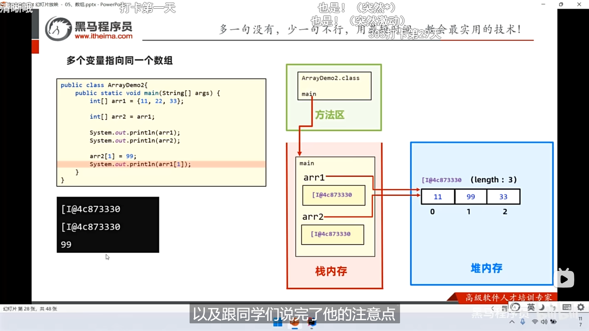

继续看黑马程序员的课程

## 数组

-   多个变量指向同一个数组 因为数组名存的是地址 赋值后也是地址
    类似于C语言的指针

-   原理图

-   空指针

-   注意 **`空指针异常`**

-   小总结

-   简单应用案例

-   找最大值

-   数组反转 (弹幕里的写法也OK）

-   随机交换数组元素

## 方法（函数）

-   和C没什么不同 多了前面的修饰符 `public static` 是公用静态的意思

-   断点 `Debug`

-   例子

-   void类型方法不用写 `return;`

-   常见注意事项

-   调用方法

-   方法的执行原理 （栈内存）

-   小总结

-   参数传递机制（值传递）

-   基本类型传递就是复制数据过去（传数据）

-   引用类型传递传地址可以改变数据（传地址）本质都是传值，Java里面数组名存的是地址

-   小总结

-   方法重载和 `return;` 关键字，去2.3看

<!-- -->

-   `println` 去掉`ln` 就不换行

-   一些小技巧

-   三目运算符 `? :`

-   一些必要的边缘检查

-   两种空数组对比（一个在堆内存创造了数组空间也就是new了一个空间，一个就只有个地址，没new空间）

-   函数传入数组首先判空，再判长度，最后判内容

-   直接`arr1.fori` 回车

-   几个简单案例

-   买机票（简单判断语句`if` 和`swtich` 和`case` 的使用）

-   随机验证码（ASCLL表和随机数生成函数结合的应用）

-   去掉最高最低求平均（1.0\*整形自动转换为浮点）

-   加密（没什么特别的 就是整数拆分而已）

-   复制数组

-   抢红包（抢到赋0）

-   最慢的筛素数

-   类似于`goto` 的语法，不推荐，不用`break`
    是因为跳出了内部循环，外部循环会打印是素数

  

-   九九乘法表（`\t` )

