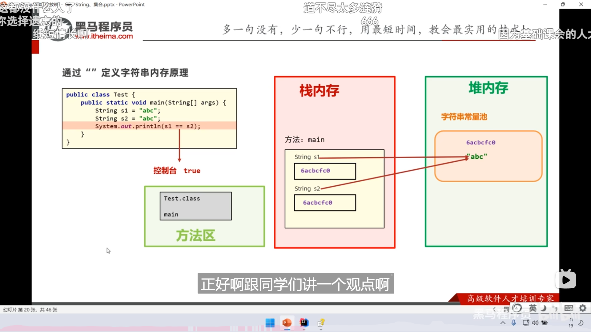

## API:String

-   两种声明方式内存原理

-   用`“”` 定义，节省内存

-   通过`new 构造器` 定义

-   小总结

-   面试题1，双引号里面的都会存到常量池算一个对象，`new`
    又会在堆内存新创建一个对象，然后把这个对象的地址给`s2`
    储存。创建2个对象。

-   如果没有上面那行，就是只创建一个对象放在字符串常量池，创建1个对象。

-   但如果有，就直接取字符串常量池里面的地址给了`s1` 储存。创建0个对象

-   最后一行代码输出的应该是`false` ，因为两个变量储存的地址不一样。

-   字符串常量池`"abc"` 的也要算作一个对象。

-   面试题2，字符串只要是在运算，就会新建一个对象。但是你一行写下来一些确定的字面量相运算 
            比如`"a"+"b"+"c"` ，那就会自动优化成 `"abc"`
    ，也是为了节省内存，所以下面那个都是指向字符串常量池里的`"abc"`
    ，没有在堆内存新创建一个对象。

-   另一个案例

-   -   一共就是 临时的`StringBuilder` 对象 加上 `toString()`
        方法生成的新的 `String`  对象。

-   内存的对象分析，创建一个新对象（本质上是一个字符数组）储存`name2`
    的数据，然后往字符数组的后面加上经过编译优化后的`HeShe`
    ，最后将这个对象转为 `String` 类型，提供给`name`

-   `StringBuilder` 的具体实现

-   也就是说，编译的时候如果遇到变量名，并不知道其指向的数据，所以只当作是一个符号，无法优化，但如果都是字面量的运算，那就可以优化。

-   案例：登陆界面

-   从 `Scanner`
    对象获得的数据不在字符串常量里面，而是在堆内存里面，用`==`
    是比较地址，地址肯定不一样，不管账号密码是否正确，会一直返回`false`

-   优雅操作

-   小总结

  

-   再学个数据库 `Mysql` ，后端的题目就大差不差了。

-   案例：验证码（以前写过）

-   对于弹幕中的问题，肯定是在堆内存里面，只有那一长串双引号引起来的的再字符串常量池里面，每循环一次就要新建一个字符串对象来储存。（涉及前面提到的`StringBuilder`
    )

## API:ArrayList

-   类似于动态数组，或者是 C++提供的stl，`vector`

-   学习方法论

-   泛型类，在使用其创建对象的时候，可以在`<>`
    里面规定数据类型，然后就只能储存这个类型了，如果不规定，那就随便装。

-   基本声明方法，最常用的是第一种

-   输出跟`String` 一样

-   一般是希望能约束存储的数据类型的，蓝色部分为较规范的创建。

-   `ArrayList<String> list = new ArrayList<>();`

-   使用例子，`remove()`
    里指定要删除的变量，是默认删除从左往右出现的第一个。

-   对于弹幕中要删除 只能存整形的动态数组里面的变量，`remove()`
    会判断为索引还是值，这个前提就不存在，因为`ArrayList`
    是泛型，不支持原始数据类型（`int` `double` `char` `byte` `short`
    ）等，泛型只能和引用类型一起使用。

-   总结

-   对于要存基本数据类型，提供了以下操作

-   回到上面弹幕的问题，有两种方案

-   如果照写，会优先按照索引的方法（可能会越界），但是显示写法或者类型转换是更加安全的方法。

-   模糊查找数组里的元素并删除的方法

-   下图的不行，因为删除后索引会变，被删除的后面会往前移，每删一次就漏遍历一个。

-   解决方案一，每次删除后`i--`
    让索引回退到被删后，相邻的往前移的元素，这样就能遍历整个数组，而不会跳过往前移的部分。对于被删元素是第一个，删完之后索引变成
    `i=-1` ，再参与循环的时候，    `i++` 后就是`i=0`
    ，就相当于索引还是0，

-   说白了就是一退一加回到被删索引的位置，在第2个位置被删就推到第1个位置后再加回到第2个位置，那么此时索引指的就是被删除之后，本来会被跳过的那个相邻元素。

-   循环中 `i++` 和 `++i` 的区别（没啥区别）

-   解决方法二，从集合的后面倒着遍历

-   注意`for` 循环是在执行完循环体后，再进行`i--` `i++` 等的操作的

-   总结

-   此处回顾一下创建实体数组

-   现在升级成 `ArrayList 实体类数组`

-   面向对象的方法不加修饰符 `static` 全局

-   接用户输入时不要接整数，尽量接字符串，因为用户乱输程序就崩了，接字符串，里面的数字在`case`
    里面要拿`"1"` 表示字符

  


